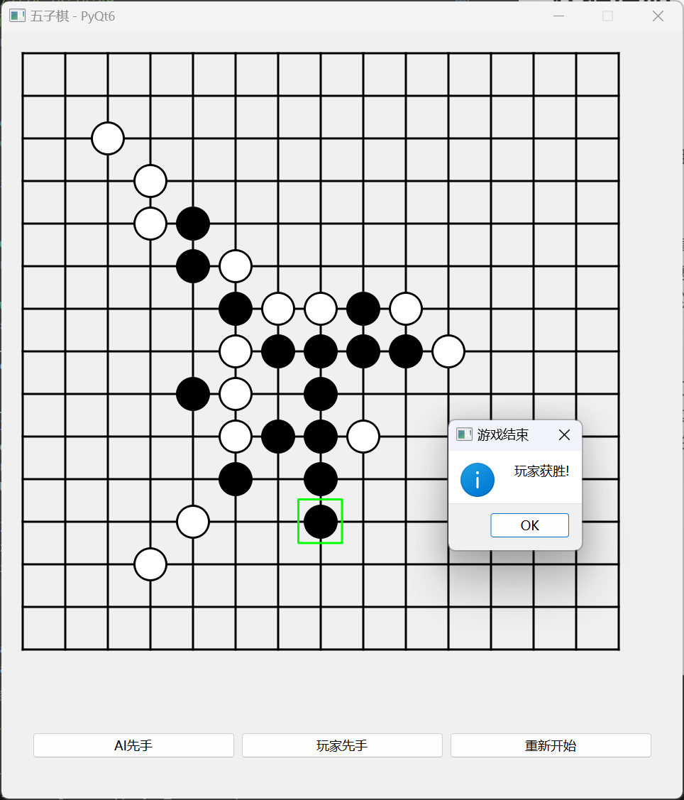

# 五子棋游戏项目

## 项目简介

这是一个基于 Python 实现的五子棋游戏项目，包含游戏逻辑、AI 对战以及基于 PyQt6 的图形用户界面。玩家可以选择与 AI 对战，支持 AI 先手或玩家先手，并且可以通过图形界面进行交互。

## 功能特点

- **游戏逻辑**：支持标准的五子棋规则，判断胜负。
- **AI 对战**：基于 Minimax 算法实现的 AI 对战功能。
- **图形界面**：使用 PyQt6 实现的图形界面，支持鼠标操作，实时显示棋盘状态。

## 项目结构

- `game.py`：定义了五子棋游戏的核心逻辑，包括棋盘初始化、落子、胜负判断、模式分析等功能。
- `minimax.py`：实现了 Minimax 算法，用于 AI 的决策过程，支持 Alpha-Beta 剪枝优化。
- `gobang.py`：基于 PyQt6 实现的图形用户界面，支持玩家与 AI 的交互。

## 使用方法

### 环境依赖
```
Python 3.8+
PyQt6
NumPy
```

### 安装依赖项：
```bash
pip install PyQt6 numpy
```

## 运行游戏

确保所有文件在同一目录下。
打开终端或命令提示符，运行以下命令启动游戏：
```bash
python gobang.py
```
游戏窗口会自动打开，玩家可以通过界面按钮选择 AI 先手或玩家先手，并通过点击棋盘进行对战。

## 游戏操作

- **AI 先手/玩家先手**：点击对应的按钮开始游戏。
- **落子**：点击棋盘上的空白格子进行落子。
- **重新开始**：点击“重新开始”按钮，重置游戏状态。
- **游戏结束**：当一方获胜或棋盘填满时，会弹出提示框显示结果。

## 代码说明

`game.py`

- 定义了 Game 类，封装了五子棋游戏的核心逻辑。
- 包括棋盘初始化、落子、胜负判断、模式分析等功能。
- 使用 NumPy 数组存储棋盘状态，提高效率。

`minimax.py`

- 实现了 Minimax 算法，用于 AI 的决策。
- 支持 Alpha-Beta 剪枝优化，减少不必要的搜索。
- AI 的搜索深度可以通过 max_depth 参数调整。

`gobang.py`

- 使用 PyQt6 实现了图形用户界面。
- 支持鼠标操作，实时绘制棋盘和棋子。
- 提供了与 AI 交互的逻辑，包括 AI 落子和玩家落子。

## 项目截图




